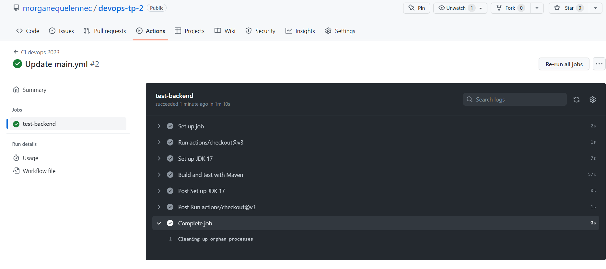

# DEVOPS - TP2

## Créer et génération les applications

>  Que sont les conteneurs de test ?

```
Les conteneurs de test sont des bibliothèques utilisées pour le développement de logiciels. Ils permettent de créer des instances de bases de données, de serveurs et d'autres composants nécessaires à l'exécution de tests de manière isolée et reproductible. Les bibliothèques mentionnées ici sont testcontainers, jdbc et postgresql et sont gérés par le groupe org.testcontainers.
```

> Documentez vos configurations d'actions Github

**Configuration permettant de test test-backend**

```yaml
# Configuration pour un pipeline CI/CD dans DevOps 2023
name: CI devops 2023

# L'événement qui déclenche l'exécution du job est un push ou une pull request sur la banche principale
  push:
    branches:
     - main # lance le job uniquement lorsqu'un code est  push sur la branche principale
  pull_request:

# Définit le job nommé test-backend
jobs:
  test-backend: 
   # Le job s'exécute sur une machine Ubuntu 22.04
   runs-on: ubuntu-22.04

   # Étapes du job
   steps:
    # Vérifie le code sur le dépôt Github
    - uses: actions/checkout@v2.5.0

    # Configure JDK 17 avec la distribution AdoptOpenJDK
    - name: Configurer JDK 17
      uses: actions/setup-java@v3
      with:
        java-version: 17
        distribution: "adopt"

    # Construise et test l'application avec Maven
    - name: Construire et tester avec Maven
      run: mvn clean verify --file simple-api/pom.xml
```
**Résultat obtenu:**



**Configuration permettant de test test-backend + build and push docker image**
```yaml
# Définition du nom du workflow
name: CI devops 2023

# Définition des événements déclencheurs
on:
  # Déclencheur pour les événements "push" sur les branches "main"
  push:
    branches:
     - main
  # Déclencheur pour les événements "pull_request"
  pull_request:

# Définition des emplois du workflow
jobs:
  # Emploi pour tester le backend
  test-backend: 
   # Exécution sur une machine virtuelle Ubuntu 22.04
   runs-on: ubuntu-22.04
   # Étapes à exécuter dans l'emploi
   steps:
    # Vérification du code à partir de GitHub avec l'action "actions/checkout@v3"
    - uses: actions/checkout@v3

    # Configuration de JDK 17 avec l'action "actions/setup-java@v3"
    - name: Set up JDK 17
      uses: actions/setup-java@v3
      with:
        java-version: 17
        distribution: "adopt"

    # Exécution des tests avec Maven
    - name: Build and test with Maven
      run: mvn -B verify sonar:sonar -Dsonar.projectKey=morganequelennec_devops-tp-2 -Dsonar.organization=mquelennec -Dsonar.host.url=https://sonarcloud.io -Dsonar.login=${{ secrets.SONAR_TOKEN }}  --file ./simple-api/pom.xml

  # Emploi pour construire et publier les images Docker
  build-and-push-docker-image:
    # Nécessite que l'emploi "test-backend" se soit terminé avec succès
    needs: test-backend
    # Exécution sur une machine virtuelle Ubuntu 22.04
    runs-on: ubuntu-22.04
    # Étapes à exécuter dans l'emploi
    steps:
      # Vérification du code à partir de GitHub avec l'action "actions/checkout@v3"
      - name: Checkout code
        uses: actions/checkout@v3

      # Connexion à DockerHub
      - name: Login to DockerHub
        run: docker login -u ${{ secrets.DOCKERHUB_USERNAME }} -p ${{ secrets.DOCKERHUB_TOKEN }}

      # Construit et publie l'image pour le service backend
      - name: Build image and push backend
        uses: docker/build-push-action@v3
        with:
          # Chemin relatif vers le code source avec Dockerfile
          context: ./simple-api
          # Nom de tag de l'image Docker en minuscules
          tags:  ${{secrets.DOCKERHUB_USERNAME}}/docker-api
          # Push sur la branche "main"

      - name: Build image and push database
        uses: docker/build-push-action@v3
        with:
          # Chemin relatif vers le code source avec Dockerfile
          context: ./database
          tags:  ${{secrets.DOCKERHUB_USERNAME}}/docker-database
          push: ${{ github.ref == 'refs/heads/main' }}

      - name: Build image and push httpd
        uses: docker/build-push-action@v3
        with:
          # Chemin relatif vers le code source avec Dockerfile
          context: ./httpd
          tags:  ${{secrets.DOCKERHUB_USERNAME}}/docker-https
          push: ${{ github.ref == 'refs/heads/main' }}
```


**Configuration permettant de test test-backend + build and push docker image + utilise l'analyse SonarCloud lors des tests**

```yaml
# Définition du nom du workflow
name: CI devops 2023

# Définition des événements déclencheurs
on:
  # Déclencheur pour les événements "push" sur les branches "main"
  push:
    branches:
     - main
  # Déclencheur pour les événements "pull_request"
  pull_request:

# Définition des emplois du workflow
jobs:
  # Emploi pour tester le backend
  test-backend: 
   # Exécution sur une machine virtuelle Ubuntu 22.04
   runs-on: ubuntu-22.04
   # Étapes à exécuter dans l'emploi
   steps:
    # Vérification du code à partir de GitHub avec l'action "actions/checkout@v3"
    - uses: actions/checkout@v3

    # Configuration de JDK 17 avec l'action "actions/setup-java@v3"
    - name: Set up JDK 17
      uses: actions/setup-java@v3
      with:
        java-version: 17
        distribution: "adopt"

    # Exécution des tests avec Maven
    - name: Build and test with Maven
      run: mvn -B verify sonar:sonar -Dsonar.projectKey=morganequelennec_devops-tp-2 -Dsonar.organization=mquelennec -Dsonar.host.url=https://sonarcloud.io -Dsonar.login=${{ secrets.SONAR_TOKEN }}  --file ./simple-api/pom.xml

  # Emploi pour construire et publier les images Docker
  build-and-push-docker-image:
    # Nécessite que l'emploi "test-backend" se soit terminé avec succès
    needs: test-backend
    # Exécution sur une machine virtuelle Ubuntu 22.04
    runs-on: ubuntu-22.04
    # Étapes à exécuter dans l'emploi
    steps:
      # Vérification du code à partir de GitHub avec l'action "actions/checkout@v3"
      - name: Checkout code
        uses: actions/checkout@v3

      # Connexion à DockerHub
      - name: Login to DockerHub
        run: docker login -u ${{ secrets.DOCKERHUB_USERNAME }} -p ${{ secrets.DOCKERHUB_TOKEN }}

      # Construction et publication de l'image pour le service backend
      - name: Build image and push backend
        uses: docker/build-push-action@v3
        with:
          # Chemin relatif vers le code source avec Dockerfile
          context: ./simple-api
          # Nom de tag de l'image Docker en minuscules
          tags:  ${{secrets.DOCKERHUB_USERNAME}}/docker-api
          # Publication uniquement pour la branche "main"

      - name: Build image and push database
        uses: docker/build-push-action@v3
        with:
          # Chemin relatif vers le code source avec Dockerfile
          context: ./database
          tags:  ${{secrets.DOCKERHUB_USERNAME}}/docker-database
          push: ${{ github.ref == 'refs/heads/main' }}

      - name: Build image and push httpd
        uses: docker/build-push-action@v3
        with:
          # Chemin relatif vers le code source avec Dockerfile
          context: ./httpd
          tags:  ${{secrets.DOCKERHUB_USERNAME}}/docker-https
          push: ${{ github.ref == 'refs/heads/main' }}
```


> Documentez votre quality gate configuration

Ce quality gate est un ensemble de critères qui doivent être remplis pour garantir la qualité du code. 
Les critères incluent: 

* La couverture de test doit être supérieure à 80%
* La duplication de lignes ne doit pas dépasser 3%
* La maintenabilité et la fiabilité doivent être notées A
* Tous les points de sécurité doivent être examinés 
* La notation de sécurité doit être A

**Résultats obtenus**


**Normes**

